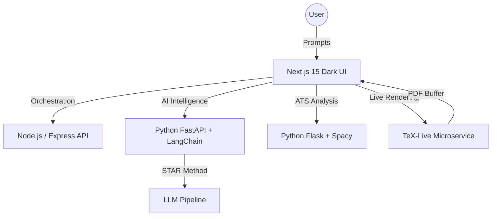

# 🚀 ResumeForge AI: The "Prompt-Based" LaTeX Builder

[](https://nextjs.org/)
[](https://tailwindcss.com/)
[](https://www.langchain.com/)
[](https://opensource.org/licenses/MIT)

ResumeForge is a high-performance, AI-powered resume building ecosystem designed to disrupt legacy tools like Overleaf. It combines **LaTeX's pixel-perfect typography** with a modern **Natural Language Prompt GUI**, a **Gamified Hireability Score**, and a real-time **ATS Optimization Engine**.

---

## 🏗️ System Architecture



---

## ✨ Core Features

- **Prompt-Based Editor**: Stop filling forms. Chat with an AI architect to rewrite your experience, change themes, or add sections using natural language.
- **STAR Method Auto-Rewriter**: Automatically transforms weak bullet points into high-impact "Situation, Task, Action, Result" statements with quantified metrics.
- **Gamified Hireability Dashboard**: Real-time circular score (0-100) that updates as you improve your resume. Includes live "Keyword Gap" analysis.
- **LaTeX Rendering Engine**: Decouples LaTeX complexity from the user. Get the gold-standard typography of `.tex` templates without writing a single line of code.
- **ATS Keyword Parser**: Semantically analyzes your resume against any Job Description (JD) to ensure you pass through automated screening filters.
- **Stunning Dark Mode**: A premium, "glassy" developer-first aesthetic with ambient glow and micro-animations.

---

## 🛠️ Tech Stack

- **Frontend**: Next.js 15 (App Router), Tailwind CSS v4, Framer Motion, Lucide Icons.
- **Backend API**: Node.js, Express, JWT Authentication.
- **AI Layer**: Python 3.9+, LangChain, OpenAI, FastAPI.
- **Parsing/NLP**: Python, Spacy, Flask.
- **PDF Engine**: TeX-Live (Dockerized microservice).

---

## 🚀 Getting Started

### 1. Prerequisites
- **Node.js** (v18+)
- **Python** (3.9+)
- **TeX-Live** (Optional, for full local PDF generation)

### 2. Installation
```bash
# Clone the repository
git clone https://github.com/TheBadshahKid/ai-resume-builder.git
cd ai-resume-builder

# Install all dependencies (Frontend, Backend, and Microservices)
npm install
cd client && npm install
cd ../server && npm install
cd ../next-client && npm install
cd ../parser-service && pip install -r requirements.txt
```

### 3. Running the Stack
Run all services concurrently with a single command:
```bash
npm run dev
```

The apps will be available at:
- **Main App (Next.js)**: [http://localhost:3000](http://localhost:3000)
- **Classic Builder (Vite)**: [http://localhost:5173](http://localhost:5173)

---

## 🎯 Development Roadmaps
- [x] Next.js 15 Migration & Dark Mode UI.
- [x] STAR Method AI Integration.
- [x] LaTeX Serverless Compiler Integration.
- [ ] Multi-template LaTeX Library.
- [ ] One-click LinkedIn Profile Import.

---

## 📜 License
Distributed under the MIT License. See `LICENSE` for more information.

---

**Built with ❤️ for developers who hate boring resumes.**
